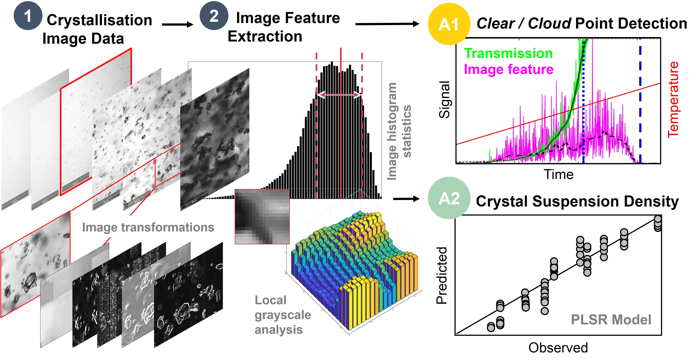

# Crystalline_ImgAnlys

<!-- About The Project -->
## About The Project
This repository combines methods for object detection and direct image feature extraction for crystallisation image datasets using MATLAB. Currently, the codebase is tailored to routinely process image and sensor data from Crystalline (Technobis Crystallization Systems, Alkmaar, The Netherlands), however, functions for object detection and direct image feature extraction can be flexibly applied to other image datasets.

<!-- Graphical Abstract -->
 

  

<!-- Structure-->
## Structure
* _Demo: contains specific demo files and demo image data (.zip). 
* _FileExchange: dependencies, please review individual file packages (Readme). Some files were modified to improve integration.
* CryExp_Masterfile.xlsx: contains parameter information with data paths and image processing parameters. Please amend to add your own image datasets. Sheet '3DAnlys': general settings and filepaths, Sheet 'ImgPrc_Param': image processing parameter.
* Crystalline_Main.m: main MATLAB file to run Crystalline image analysis routine.
* Crystalline_ImgAnlys.m: image analysis routine which includes Object Detection (Crystalline_ImgPrc), Direct Image Feature Extraction (Crystalline_ImgAnlys_Feat) and Object Parameterisation (Crystalline_ImgAnlys_ObjPara).
* Crystalline_DataAnlys.m: data analysis for post-processing of extracted direct image features for clear/cloud point detection and plotting.

<!-- Getting Started-->
## Getting Started
To add your own datasets to the image analysis:
- Open parameter file 'CryExp_Masterfile.xlsx' and amend/add row with details on your image dataset: see sheet 'Crystalline' for details on image dataset, see 'Prc_ImgAnlys' for image processing parameters
- Open the main file (XRT_3DAnlys_MAIN.m) and run script. The datasets will be analysed according to their order in 'CryExp_Masterfile.xlsx\Crystalline'. The MATLAB analysis will run through the datasets until it encounters an empty row.

<!-- References-->
## References (open access):
- Frederik J. S. Doerr, Cameron J. Brown, and Alastair J. Florence (2022). *Direct Image Feature Extraction and Multivariate Analysis for Crystallization Process Characterization.* Cryst. Growth Des. [https://doi.org/10.1021/acs.cgd.1c01118](https://doi.org/10.1021/acs.cgd.1c01118)

Data repository: [https://doi.org/10.15129/75002e1c-80dc-42ab-984a-3444fbef9c03](https://doi.org/10.15129/75002e1c-80dc-42ab-984a-3444fbef9c03)  
